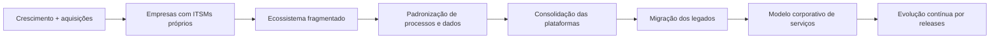
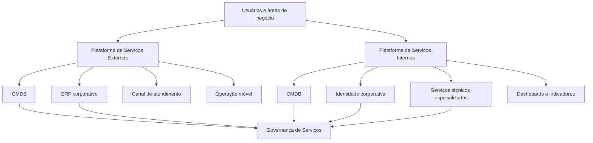
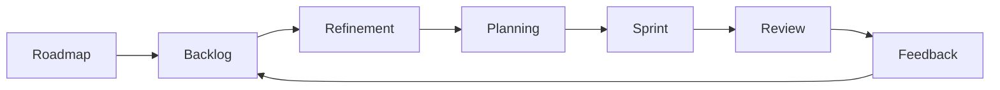
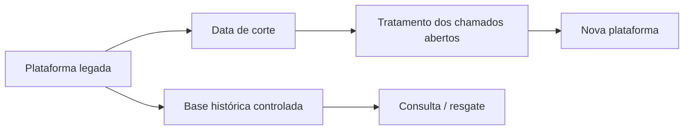

# Transformação de uma Plataforma de Gestão de Serviços de TI

### Case de Gerenciamento de Projetos | ITSM & Services | ITIL v4 | Enterprise Service Management | Agile Delivery

**Gerente de Projetos:** João Henrique Gusmão Esteves  
**Modelo de entrega:** Programa evolutivo por frentes, releases e sprints  
**Abordagem:** Híbrida — governança preditiva + execução adaptativa

> **Confidencialidade:** este case foi reconstruído para fins de portfólio a partir de evidências reais de projeto. Como a transformação permanece em evolução, foram removidos ou generalizados nomes da organização, clientes, fornecedores, plataformas internas, pessoas, URLs, IDs de chamados e work items, valores, datas específicas, credenciais e detalhes de arquitetura que poderiam identificar o ambiente. Os termos **ITSM**, **ITIL v4**, **ESM**, **CMDB**, **Scrum** e **Azure DevOps** foram mantidos por representarem disciplinas e tecnologias de mercado.

---

## Visão Geral

| Dimensão | Síntese |
| :--- | :--- |
| Cenário inicial | Crescimento orgânico e aquisições trouxeram empresas com plataformas de ITSM, processos e legados distintos |
| Origem do programa | Integração pós-aquisição dentro de um contexto de M&A, com necessidade de consolidar o ecossistema de gestão de serviços |
| Estratégia | Unificação progressiva da gestão de serviços em uma plataforma corporativa com uso para contextos externos e internos |
| Modelo operacional | ITSM + evolução para Enterprise Service Management |
| Fundamento de processos | ITIL v4 |
| Entrega | Implantação por frentes e releases, seguida de evolução contínua |
| Governança | TAP, Status Report, gestão de mudanças, riscos, cerimônias ágeis e rastreabilidade em board |
| Situação atual | Implantação-base concluída em frentes prioritárias e release evolutiva em andamento |
| Meu papel | GP em uma frente de implantação e na release evolutiva atual; apoio em uma release intermediária conduzida por outra GP |

---

## Contexto e Desafio

O programa nasceu diretamente de um movimento de **crescimento orgânico e aquisições de empresas**. Dentro desse contexto de **M&A (Mergers & Acquisitions)**, a organização passou a incorporar operações que traziam consigo **plataformas de ITSM, processos, integrações, catálogos, bases de configuração e modelos de atendimento próprios**.

Esse tipo de cenário é tratado, na prática, como uma **integração pós-aquisição**: após a transação societária, é necessário integrar não apenas estruturas organizacionais, mas também processos, dados e tecnologias herdadas das empresas adquiridas.

Como consequência, o ambiente passou a conviver com **múltiplos ITSMs legados e diferentes formas de operar o mesmo tipo de serviço**. O desafio deixou de ser simplesmente substituir uma ferramenta. Era necessário consolidar um ecossistema fragmentado sem comprometer a continuidade operacional.

Os principais desafios eram:

- coexistência de plataformas de ITSM herdadas de empresas distintas;
- processos, catálogos, SLAs e regras operacionais diferentes;
- múltiplas integrações e fontes de dados;
- níveis distintos de maturidade e governança;
- necessidade de preservar continuidade e histórico durante as migrações;
- necessidade de padronizar serviços internos e externos;
- dependências de sistemas corporativos e fornecedores;
- rastreabilidade de chamados, ativos e itens de configuração;
- necessidade de desligar gradualmente soluções legadas sem perda operacional;
- transformação da implantação inicial em uma **esteira contínua de evolução**.

A iniciativa passou, portanto, a representar uma frente tecnológica de **integração pós-aquisição**, usando a gestão de serviços como mecanismo de padronização operacional e tecnológica.

---

## Meu Papel no Programa

Minha participação ocorreu em diferentes momentos e com níveis distintos de responsabilidade.

| Etapa | Papel exercido | Situação |
| :--- | :--- | :--- |
| Plataforma de serviços externos | **Gerente de Projetos** | Implantação conduzida até entrega do MVP e transição para evolução |
| Plataforma interna — Release intermediária | **Apoio à gestão** | Release conduzida formalmente por outra Gerente de Projetos |
| Plataforma interna — Release evolutiva atual | **Gerente de Projetos** | Evolução contínua conduzida por backlog, sprints e governança ágil |

Essa distinção é intencional: o case apresenta a **jornada do programa**, mas preserva corretamente o ownership de cada etapa.

### Principais responsabilidades exercidas como GP

- estruturação e manutenção da governança do projeto;
- coordenação entre áreas de negócio, tecnologia e parceiros;
- condução de Kick-off, checkpoints e Status Reports;
- gestão de cronograma, escopo, riscos, dependências e mudanças;
- acompanhamento de requisitos e critérios de aceite;
- organização do fluxo de decisão entre Sponsor, Product Owner, arquitetura e times técnicos;
- gestão de cutover e transição de plataformas legadas;
- acompanhamento de integrações e dependências externas;
- organização da operação assistida;
- transição de itens não concluídos para backlog evolutivo;
- estruturação da execução adaptativa em Azure DevOps;
- acompanhamento de Refinement, Planning, Sprint e Review;
- preservação da rastreabilidade entre decisão, backlog, evidência e entrega.

---

## Jornada da Transformação

### 1. Implantação para serviços externos

A primeira frente priorizada estruturou uma plataforma voltada à operação de serviços externos.

O escopo funcional incluiu, de forma anonimizada:

- portal de serviços;
- catálogos e SLAs;
- fluxos críticos de atendimento;
- CMDB;
- aplicativo para equipes de campo;
- integrações com sistemas corporativos e plataformas de terceiros;
- dashboards operacionais;
- treinamento de usuários técnicos e de negócio.

Durante a execução, o projeto precisou absorver mudanças relevantes em requisitos, integrações e estrutura de dados.

O resultado foi um **MVP colocado em operação**, com pendências e melhorias formalmente direcionadas para uma esteira evolutiva posterior.

---

### 2. Migração da plataforma interna — Release intermediária

Na sequência, o programa migrou o atendimento interno de uma solução legada para a nova plataforma.

Essa release foi conduzida formalmente por outra Gerente de Projetos, com minha participação de apoio.

O escopo contemplou:

- portal interno;
- catálogo de serviços;
- requisições e incidentes;
- SLAs;
- gestão de mudanças;
- gestão de problemas;
- gestão de disponibilidade;
- CMDB;
- base de conhecimento;
- relatórios;
- treinamento;
- integração com serviços técnicos especializados;
- descontinuação controlada da plataforma anterior.

Um ponto relevante foi a necessidade de desenhar uma estratégia específica para os **chamados ainda em atendimento no momento da migração**.

---

### 3. Release evolutiva atual

Após a implantação-base, a plataforma interna passou a operar em uma lógica de **produto em evolução contínua**.

A release atual concentra frentes como:

- evolução de CMDB;
- gestão de mudanças;
- disponibilidade;
- integrações;
- sincronização de identidades;
- segurança da informação;
- automações;
- dashboards gerenciais;
- melhoria de catálogos;
- observabilidade e rastreabilidade operacional.

A gestão deixou de depender de um único cronograma de implantação e passou a combinar **roadmap, backlog priorizado e ciclos de sprint**.

---

## Escopo Funcional Anonimizado

### Plataforma de Serviços Externos

| Capacidade | Aplicação |
| :--- | :--- |
| Portal de serviços | Entrada estruturada de solicitações e acompanhamento |
| Catálogos e SLAs | Padronização de ofertas e níveis de atendimento |
| CMDB | Estrutura de itens de configuração e relacionamentos |
| Mobilidade | Suporte a equipes operacionais em campo |
| Integrações | Troca de dados com ERP, canais de atendimento e sistemas de clientes |
| Dashboards | Visibilidade operacional e acompanhamento de indicadores |
| Workflows | Automação dos principais fluxos de serviço |

### Plataforma de Serviços Internos

| Capacidade | Aplicação |
| :--- | :--- |
| Gestão de Solicitações e Incidentes | Tratamento de solicitações e incidentes internos |
| Gestão de Mudanças | Fluxo estruturado de mudanças e aprovações |
| Gestão de Problemas | Registro e acompanhamento de causas e recorrências |
| Gestão de Disponibilidade | Registro e tratamento de indisponibilidades |
| CMDB | Estrutura de configuração e relacionamentos entre ICs |
| Gestão do Conhecimento | Base de conhecimento e apoio à operação |
| Integração de Identidades e Acessos | Sincronização controlada de dados de pessoas e acessos |
| Dashboards | Indicadores para serviços, mudanças, configuração e gestão |

---

## Arquitetura Conceitual

A arquitetura real possui integrações e componentes específicos que não são reproduzidos neste portfólio. Abaixo está apenas a **visão funcional generalizada**.

---

## Governança do Programa

O modelo de governança evoluiu junto com o programa.

### Implantação

Na fase de implantação, os principais controles eram:

- Termo de Abertura;
- cronograma macro;
- papéis e responsabilidades;
- checkpoints técnicos;
- Status Report operacional;
- Status Report executivo;
- gestão formal de mudança;
- registros de risco e dependência;
- evidências de teste;
- plano de Go-Live;
- Termo de Entrega.

### Evolução contínua

Com a maturidade da plataforma, a execução passou a utilizar:

- Product Backlog;
- Épicos, Features e User Stories;
- critérios de aceite;
- Refinement;
- Planning;
- sprints;
- Reviews;
- gestão de bugs;
- rastreabilidade em Azure DevOps;
- priorização conjunta entre negócio, produto e tecnologia.

---

## Gestão de Mudanças de Escopo

Um dos aprendizados centrais ocorreu quando requisitos importantes apareceram **após o planejamento inicial**.

Entre os tipos de mudança enfrentados estavam:

- novos fluxos de serviço;
- novos campos e regras;
- APIs não previstas inicialmente;
- alteração da origem de dados;
- reestruturação do CMDB;
- necessidade de novas validações;
- dependências adicionais de fornecedores e áreas externas.

Essas mudanças provocavam impacto em cadeia:

### Respostas de gestão adotadas

- formalização de Change Requests quando aplicável;
- registro das atividades não previstas;
- replanejamento de marcos;
- revisão de dependências;
- priorização por criticidade;
- separação entre pendência de Go-Live e melhoria evolutiva;
- transferência estruturada de itens para backlog.

---

## CMDB como Frente Estruturante

A CMDB deixou de ser tratada apenas como cadastro de ativos e passou a representar uma **camada estrutural do serviço**.

O trabalho envolveu:

- definição de classes e atributos;
- relacionamentos entre itens de configuração;
- revisão de fontes de dados;
- regras para integridade dos relacionamentos;
- controle de duplicidade;
- rastreabilidade de alterações;
- associação entre incidentes, mudanças e indisponibilidades;
- evolução para operações de relacionamento em massa.

Essa frente demonstrou que mudanças de origem ou modelagem de dados podem gerar impacto significativo em fluxos e integrações dependentes.

---

## Gestão de Mudanças e Disponibilidade

Na release evolutiva atual, duas disciplinas passaram a receber atenção especial.

### Change Management

A evolução do processo incluiu:

- maior visibilidade das mudanças;
- melhoria de aprovações;
- atuação estruturada de gestores de mudança;
- tratamento de diferentes tipos de mudança;
- rastreabilidade entre etapas;
- melhoria da governança de execução e encerramento.

### Availability Management

A solução passou a estruturar:

- registro de indisponibilidade;
- associação com incidentes;
- vínculo com itens de configuração;
- datas reais de início e fim;
- negociação de indisponibilidade;
- aprovações;
- base para indicadores futuros.

---

## Cutover e Descontinuação do Legado

A migração da plataforma interna exigiu uma decisão específica sobre o que fazer com chamados ainda abertos no sistema anterior.

O plano considerou alternativas como:

1. migração manual pelo responsável atual;
2. nova abertura pelo usuário na plataforma de destino;
3. definição de uma data de corte antes do Go-Live;
4. manutenção de uma base legada somente para consulta.

A solução também previu um mecanismo controlado para **resgate de histórico**, evitando que o ambiente legado continuasse sendo utilizado operacionalmente.

### Princípio adotado

> Migrar o que é necessário para continuidade operacional sem transformar a mudança de plataforma em uma migração indiscriminada de todo o histórico legado.

---

## Gestão de Riscos e Dependências

Os principais grupos de risco observados ao longo do programa foram:

| Risco / dependência | Tratamento |
| :--- | :--- |
| Requisitos identificados tardiamente | Refinamento, análise de impacto e repriorização |
| Alterações na estrutura de dados | Reavaliação de CMDB e integrações dependentes |
| Dependências de fornecedores | Acompanhamento por marcos e responsáveis |
| Chamados em andamento no cutover | Plano específico de transição |
| Disponibilidade de Key Users | Cerimônias, validações e critérios de aceite |
| Bugs herdados entre sprints | Priorização explícita dentro da capacidade da squad |
| Transbordo de itens | Registro, replanejamento e retorno ao backlog |
| Entrada de demandas durante a sprint | Avaliação de capacidade e rastreabilidade do esforço adicional |

---

## Agile Delivery na Release Atual

A release atual utiliza uma execução mais próxima de **produto digital**, mantendo governança de projeto sem perder adaptabilidade.

### Exemplos de evolução trabalhada nas sprints

- melhorias de CMDB;
- relacionamento de itens de configuração;
- evolução de fluxos de mudança;
- gestão de indisponibilidade;
- integrações;
- automações;
- sincronização de dados;
- melhorias de segurança e rastreabilidade;
- correções de bugs;
- dashboards e visões gerenciais.

### Princípios utilizados

- backlog priorizado;
- critérios de aceite documentados;
- estimativa colaborativa;
- Definition of Ready;
- Definition of Done;
- Review como validação real de entrega;
- registro de transbordos;
- visibilidade de itens bloqueados;
- melhoria contínua a partir do feedback das áreas.

---

## Principais Decisões Gerenciais

### 1. Separar implantação de evolução

O Go-Live não foi tratado como encerramento de toda necessidade futura. Itens de melhoria passaram a compor backlog evolutivo estruturado.

### 2. Preservar governança dentro do Agile

A adoção de sprints não eliminou controle de risco, mudança, evidência e decisão.

### 3. Tratar o legado como problema de transição, não como destino permanente

A estratégia de cutover definiu regras de continuidade, consulta histórica e restrição de uso após a virada.

### 4. Evoluir a CMDB junto com os processos

Alterações de dados foram avaliadas pelo impacto nos serviços, integrações e workflows.

### 5. Diferenciar conclusão funcional de conclusão administrativa

Uma entrega demonstrada em Review não é automaticamente considerada pronta para produção sem evidências e critérios aplicáveis.

---

## Resultados Consolidados

### Entregas já concluídas

- implantação de uma frente de serviços externos;
- portal, workflows, CMDB, integrações e mobilidade colocados em operação;
- estruturação de dashboards e relatórios críticos;
- migração da plataforma interna legada em release própria;
- definição de estratégia de cutover e preservação de histórico;
- criação de uma base de governança para evolução contínua.

### Evolução em andamento

- fortalecimento da CMDB;
- evolução de Change Management;
- gestão de disponibilidade;
- integrações e identidade;
- segurança e automações;
- melhoria de catálogos;
- indicadores gerenciais;
- redução de pendências técnicas por ciclos de sprint.

> O principal resultado do programa é a transição de um cenário fragmentado de ferramentas e processos para um **modelo de gestão de serviços governado, evolutivo e orientado por produto**, sem perder os controles necessários de projeto.

---

## Lições Aprendidas

1. **ITSM não é apenas implantação de ferramenta.** Processos, dados, integrações e governança precisam evoluir juntos.
2. **CMDB deve ser tratada como arquitetura operacional.** Mudanças de fonte ou relacionamento podem impactar vários fluxos simultaneamente.
3. **Cutover precisa ser decidido antes da virada.** Chamados em andamento, histórico e comunicação não devem ficar para a semana do Go-Live.
4. **Change Management continua necessário em contexto ágil.** Sprints não eliminam impacto em escopo, prazo, custo ou dependências.
5. **Separar “pendência de implantação” de “melhoria de produto” reduz ruído.** Nem toda evolução precisa bloquear o encerramento de uma entrega.
6. **Review deve ser baseada em evidência.** O que não foi demonstrado ou confirmado não deve ser contabilizado como concluído.
7. **Ownership precisa ser explícito.** Em programas longos, diferentes releases podem ter diferentes responsáveis; o portfólio deve refletir isso corretamente.
8. **Rastreabilidade sustenta a escala.** Board, documentos, decisões, riscos e evidências precisam conversar entre si.

---

## Tecnologias, Métodos e Disciplinas

  
  
  
  
  
  
  
  
  

---

## Sobre este Case

Este repositório apresenta uma **reconstrução profissional e fortemente anonimizada** de uma transformação de ITSM que possui etapas concluídas e uma release evolutiva ainda em andamento.

Nenhum documento corporativo original é publicado.

O objetivo é demonstrar como a iniciativa foi:

**estruturada → governada → implantada → migrada → estabilizada → transformada em uma esteira contínua de evolução.**

**João Henrique Gusmão Esteves**  
Gerenciamento de Projetos de Tecnologia | PMO | Transformação Digital

